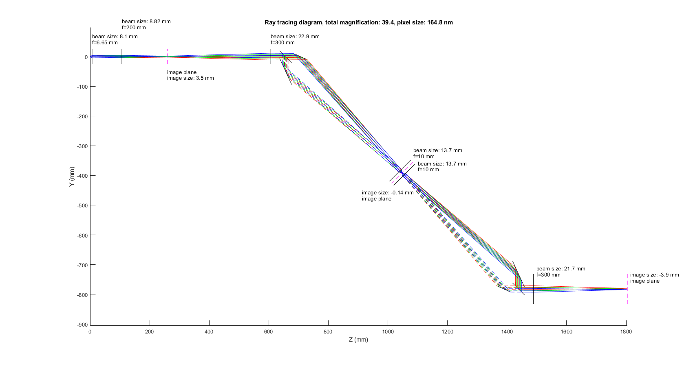

# Ray tracing for Axial-descanning microscope

This package contains ray tracing simulation of an axial-descanning microscope. The code is written in MATLAB. 

**Reference**: [D. Hassan, et al. "Axial de-scanning using remote focusing in the detection arm of light-sheet microscopy." bioRxiv (2023).](https://doi.org/10.1101/2023.09.07.556729)

## How to run
Run the script [raytracing_demo.m](ray_tracing_axial_descan/raytracing_demo.m) to start the simulation. The script will generate a 2D plot of the ray tracing of the microscope as below.

